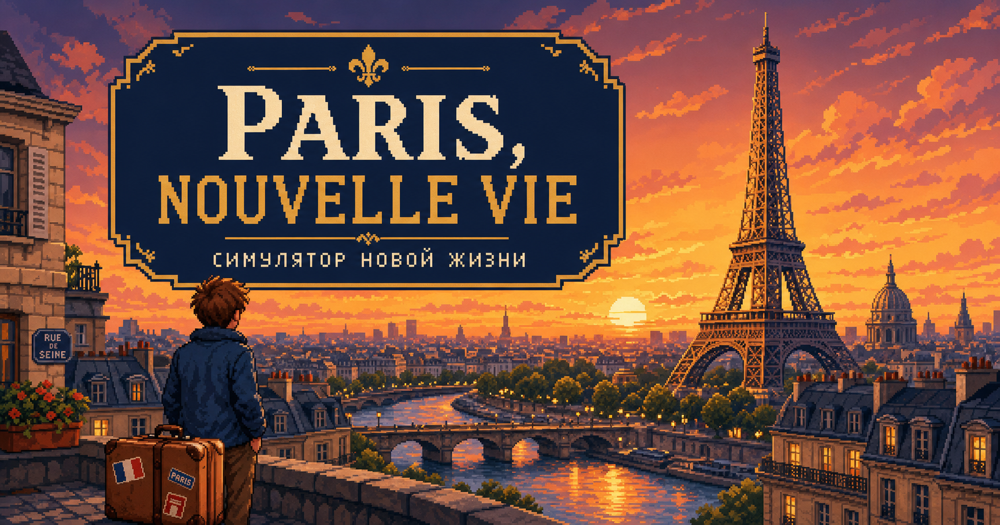

# Paris, Nouvelle Vie



Браузерная 2D-игра о переезде в Париж, адаптации к жизни во Франции и пути к гражданству. Игрок создаёт героя, выбирает иммиграционный путь и проживает пять насыщенных глав, где каждое решение меняет характеристики и сюжет.

> Текущая версия — локальный вертикальный срез. Игровые правила намеренно упрощены и не являются юридической консультацией.

## Что уже работает

- создание персонажа: имя, пол и возраст;
- четыре стартовых пути: бакалавриат, магистратура, Passeport talent и семейный ВНЖ;
- восемь пиксельных NPC с сюжетными разговорами, отношениями, личными поручениями и раскрывающимися историями;
- интерактивная карта с Эйфелевой башней, Лувром, Сорбонной, Монмартром, Нотр-Дамом и другими местами;
- масштабируемая и перемещаемая схема парижского метро на основе открытых данных Île-de-France Mobilités;
- смена рассвета, дня, заката и ночи в зависимости от игрового времени;
- выбор времени пробуждения, анимированные поездки, учёба, подработка, отдых, бюрократия и культурные активности;
- шесть сюжетных событий с последствиями для денег, языка, досье, интеграции и устойчивости;
- цели на каждый год, локальное автосохранение и журнал истории;
- финальное интервью на ассимиляцию и получение французского гражданства.

## Локальный запуск

Нужен Node.js 22.13 или новее.

```bash
npm install
npm run dev
```

Откройте [http://localhost:3000](http://localhost:3000).

## Проверка

```bash
npm test
npm run lint
npx tsc --noEmit
```

Официальный слой метро уже сохранён в проекте и не требует сети во время игры. Чтобы вручную обновить его из открытых данных:

```bash
npm run metro:data
```

## Технологии

Next.js 16, React 19, TypeScript, Vinext/Vite и чистая CSS-пиксельная графика. Прогресс хранится локально в `localStorage`; сервер и база данных для прототипа не требуются.

Схема метро построена по наборам «Tracés schématiques du réseau de transport ferré» и «Gares et stations du réseau ferré schématique» от Île-de-France Mobilités, распространяемым по Licence Ouverte 2.0 (Etalab). В игре используется собственная интерактивная 8-битная визуализация этих данных.

## Следующая глава

Поиск работы, долгосрочная аренда, карьерные ветки, расширенная экономика и жизнь после получения гражданства.
